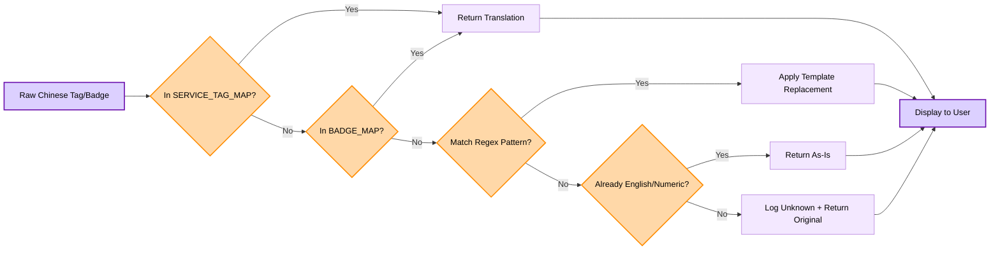

<h1 align="center"><b><font color="#FF8C00">1688</font> <font color="#000080">LINGO BRIDGE</font></b></h1>

<div align="center">

<!-- Badges -->
<a href="https://1688-lingo-bridge.vercel.app/"></a>


<p>
  <!-- Demo video placeholder -->
  <a href="https://1688-lingo-bridge.vercel.app/">
    
  </a>
</p>

## [Demo](https://1688-lingo-bridge.vercel.app/)

**Bridging the gap between English intent and Chinese supply with Lingo.dev and GPT-4o**

──●────
</div>

## Table of Contents
- [ ㄨ The Problem](#ㄨ-the-problem) 
- [ ★ The Solution](#-the-solution)
- [ ▶︎ Demo](#demo)
- [ 𒈔 Tech Stack](#𒈔-tech-stack)
- [ 𖠿 Key Features](#𖠿-key-features)
- [ 𝐆 Domain Glossary & Context Rules](#-domain-glossary--context-rules)
- [ 🗺 Lingo.dev Integration](#-lingodev-integration)
- [ 𖤘 Tag & Badge Translation](#𖤘-tag--badge-translation)
- [ 🖿 Repository Structure](#-repository-structure)
- [ ⾕ Setup & Usage](#setup-and-usage)
- [ ⏯ Performance Demos (CLI)](#-performance-demos-cli)
- [ ꪜ Performance & Verification](#ꪜ-performance--verification)

---

## ㄨ The Problem
1688.com is the world's most competitive wholesale marketplace, offering "factory-direct" pricing that is often 30-50% cheaper than Alibaba.com. However, it is **exclusively in Chinese**.

Traditional scraping and translation methods fail because:
1. **Semantic Drift:** Literal translations of English queries often return irrelevant Chinese results (e.g., "carbide mills" returning "Cake Moulds").
2. **Technical Jargon:** Standard translation fails on e-commerce specific terms like "起批量" (MOQ) or "包邮" (Free Shipping).
3. **Product Baiting:** Suppliers often list accessories (cables, bags) using the main product's keywords at a fraction of the price to "bait" search results.

## ★ The Solution
**1688 Lingo Bridge** is an intelligent data pipeline that 
goes beyond simple translation. It understands the **intent** 
of a buyer's query, translates it into native Chinese 
industry jargon, and validates results using a multi-tier 
confidence scoring system.

The pipeline has 4 stages:

1. **lingo.dev SDK** generates semantic search bundles 
   with synonyms and negative keywords
2. **Adaptive scraping** expands to synonyms when 
   results are thin
3. **GPT-generated scoring models** create per-query 
   relevance signals on the fly
4. **GPT-4o-mini vision** audits product images to 
   catch accessory bait

By combining **Apify's** residential scraping, 
**Lingo.dev's** context-aware localization, and 
**OpenAI's** vision capabilities, what you search for 
is actually what you find.

<a id="demo"></a>
## ▶︎ Demo

### Dashboard


*Real-time procurement intelligence with confidence scoring*

### Pipeline Output ⤵︎
<details>
<summary>Click to see terminal output</summary>

```text
🚀 Starting smart scrape...   📯 Primary: 户外电源储能
   📋 Synonyms: [便携式储能, 露营电源, 移动储能]
   🚫 Blacklist: [模具, 餐垫, 硅胶...]
   ⏱️ Primary scrape: 294ms (16 results)
   ⚠️ Only 16 results (threshold: 20), expanding to synonyms...
   ✅ Smart scrape complete: 60 results in 11268ms

📊 PIPELINE SUMMARY
   Original Query: "outdoor power supply energy storage"
   Chinese Query: "户外电源储能"
   Total Results: 60
   Average Confidence: 70.5%
   High Confidence: 45
   Filtered by Blacklist: 0
```
</details>

## 𒈔 Tech Stack
- **Data Extraction:** [Apify](https://apify.com) 
(Recommended: `devcake/1688-com-products-scraper`)
- **Localization Engine:** [Lingo.dev SDK](https://lingo.dev)
- **Vision Validation:** OpenAI GPT-4o-mini
- **Environment:** Node.js (ESM)
- **Configuration:** `i18n.json` — category-keyed glossary, vision rules, and scoring signals with `general`/`default` fallbacks for any product vertical

## 𖠿 Key Features
- **Semantic Search Bridge:** Translates user intent into native SEO keywords (e.g., "Portable Power Station" → "便携式储能电源") rather than literal translations.
- **Multi-Factor Confidence Scoring:**
    - **Category Match:** Prioritizes technical industry categories over generic ones.
    - **Price Guard:** Automatically flags "Accessory Bait" by detecting products priced <10% of the median result.
    - **Dynamic Scoring Signals:** GPT generates a unique 
  relevance model per query — category keywords, spec 
  patterns, and price expectations — so every product 
  category gets its own ranking algorithm.
- **Vision Guard:** AI-powered image verification with a robust `default` prompt that handles **any** product vertical (toys, beauty, automotive, kitchenware, etc.) out of the box. Category-specific overrides are added only where the default needs extra guardrails — unknown verticals degrade gracefully instead of being silently skipped.
- **Hybrid Localization:** Category-keyed glossary for zero drift on known terms, SDK fallback for unknowns. Add new verticals by extending `i18n.json` — no code changes required.
- **Extensible Config:** All glossary terms, negative keywords, synonyms, suspicious terms, and vision rules are organized by vertical in `i18n.json`. The `general` and `default` keys ensure the pipeline works for any product type out of the box.

## 𝐆 Domain Glossary & Context Rules

The pipeline uses a **two-tier** glossary strategy:

### Tier 1: Static Category-Keyed Glossary (`i18n.json`)

Known industry terms are organized by vertical in `i18n.json` and can be extended without code changes:

```json
"glossary": {
  "electronics": [{ "src": "氮化镓", "tgt": "Gallium Nitride (GaN)" }],
  "textiles":    [{ "src": "桑蚕丝", "tgt": "Mulberry Silk" }],
  "power":       [{ "src": "户外电源", "tgt": "Portable Power Station" }],
  "general":     [{ "src": "起订量", "tgt": "MOQ" }, { "src": "批发", "tgt": "Wholesale" }]
}
```

At startup, consumers flatten all categories into a single reverse-lookup map via `Object.values().flat()`, so downstream code is category-agnostic. To support a new product vertical, add a new key — no code changes required.

### Tier 2: Dynamic GPT-Generated Scoring Signals

For each search query, GPT generates a **per-query relevance model** at runtime. This ensures scoring adapts to any product domain without manual term curation.

**What GPT generates per query:**

- **Positive keywords** — Strong relevance signals (e.g., `HRC` for carbide queries, `Wh` for power station queries)
- **Moderate keywords** — Supporting context terms that contribute partial scoring weight
- **Blacklist terms** — Negative signals that indicate an irrelevant product should be penalised

**Why two tiers?**

| Layer | Purpose | Example |
|-------|---------|--------|
| Static glossary | Zero-drift anchor for known terms | "桑蚕丝" always → "Mulberry Silk" |
| Dynamic GPT signals | Adapts scoring to any unknown vertical | Generates `HRC`, `刀具` for a carbide mill query |

A static glossary alone would fail across the wide range of product domains on 1688. By combining anchored terms with dynamically generated context rules, the pipeline handles both known and novel queries.

### Example

A search for `户外电源` (outdoor power station) might produce:

```text
Positive:   便携式电源, 锂电池, 逆变器, Wh, 交流输出
Moderate:   太阳能充电, USB, 应急电源
Blacklist:  玩具, 装饰, 手机壳
```

These dynamic terms are **not stored or reused** — they are regenerated for each pipeline execution to match the specific query context.

## 🗺 Lingo.dev Integration

This project uses the **Lingo.dev SDK** with a hybrid translation strategy for maximum accuracy:

### How It Works

```
English Query → Category Glossary Lookup → SDK Fallback → Chinese Search Bundle
```

1. **Glossary First (Zero Drift):** Known industry terms are matched from the category-keyed glossary in `i18n.json`. All verticals are flattened into a single reverse-lookup map at startup:
   ```javascript
   // "Mulberry Silk" → "桑蚕丝" (always consistent, from textiles vertical)
   // "GaN Charger" → "氮化镓充电器" (industry standard, from electronics vertical)
   // "Wholesale" → "批发" (common B2B term, from general vertical)
   ```

2. **SDK Fallback (Context-Aware):** Unknown terms use `lingo.localizeText()`:
   ```javascript
   import { LingoDotDevEngine } from "lingo.dev/sdk";
   
   const lingo = new LingoDotDevEngine({ apiKey: process.env.LINGODOTDEV_API_KEY });
   
   const translated = await lingo.localizeText("outdoor power supply energy storage", {
       sourceLocale: "en-GB",
       targetLocale: "zh-CN"
   });
   // → "户外电源储能" (native industry term)
   ```

3. **SEO Optimization:** Chinese terms are split for 1688's space-as-AND search algorithm.

### Why This Matters

| Approach | "Power Station" Result |
|----------|------------------------|
| Literal Translation | "电站" (power plant — wrong context) |
| **Lingo.dev SDK** | "户外电源" (outdoor power supply — correct) |

The SDK understands **context** — it knows that "Power Station" in an e-commerce/camping context means a portable battery, not a power plant.

## 𖤘 Tag & Badge Translation

Service tags and product badges are translated using a **hybrid lookup system** for zero-cost, instant translations:

### Translation Pipeline



### Example Translations

| Chinese Tag | English Translation | Source |
|-------------|---------------------|--------|
| 退货包运费 | Free return shipping | Lookup Table |
| 运费险 | Shipping insurance | Lookup Table |
| 回头率40% | Repurchase rate: 40% | Regex Pattern |
| 72小时发货 | Ships within 72h | Regex Pattern |
| ISO9001 | ISO9001 | Pass-through |

### Implementation

```typescript
import { translateTag, translateTags } from './data/translations';

// Translate a single tag
translateTag('退货包运费'); // → "Free return shipping"

// Translate multiple tags
translateTags(['运费险', '深度验厂', '回头率35%']);
// → ["Shipping insurance", "Verified factory", "Repurchase rate: 35%"]
```

### Why Lookup Tables?

| Approach | Cost per 1000 Products | Latency |
|----------|------------------------|---------|
| **Lookup Table** | $0 (in-memory) | ~0ms |
| AI Translation | ~$0.50-2.00 | 100-500ms |

For ~20 unique tags/badges across 1688, lookup tables are cheaper, faster, and 100% consistent.

See [`src/data/translations.ts`](src/data/translations.ts) for the full implementation.


## 🖿 Repository Structure
```text
.
├── src/
│   ├── core/
│   │   ├── main.js              # Backend pipeline entry point (Node)
│   │   ├── validator.js         # Signal-based confidence scoring
│   │   ├── queryProcessor.js    # AI search bundle generation
│   │   ├── scraper.js           # Smart 1688 scraping
│   │   └── visionValidator.js   # GPT-4o image verification
│   ├── data/
│   │   └── i18n.json            # Category-keyed glossary, vision rules & scoring config
│   ├── main.ts                  # Frontend dashboard (Vite)
│   └── style.css                # Global dashboard styles
├── docs/
│   ├── Roadmap.md               # Project roadmap
│   └── artifacts/               # Validated results storage
├── tests/
│   ├── validate_scoring.test.js
│   ├── translation.test.js      
│   └── vision_bridge.test.js
└── README.md
```
<a id="setup-and-usage"></a>
## ⾕ Setup & Usage

1. **Clone the Repo:**
```bash
    git clone https://github.com/nadinev6/1688-lingo-bridge.git
```
2. **Install Dependencies:**
```bash
npm install
```

3. **Configure Environment:**
Create a `.env` file with your API keys:
```bash
APIFY_TOKEN=your_apify_api_token
LINGODOTDEV_API_KEY=your_lingo_api_key
OPENAI_API_KEY=your_openai_api_key
```

4.  **Start the Dashboard:**
```bash
npm run dev
# Open http://localhost:5173
```

## ⏯ Performance Demos (CLI)

| Command | Description |
|---------|-------------|
| `node main.js phase1` | Post-scraping translation only |
| `node main.js phase2` | Intent transformation demo |
| `node main.js phase3` | Validated pipeline (no vision) |

### Examples
```bash
# Fresh run with new query
node src/core/main.js phase4 "tungsten carbide end mills"

# Append results to existing file
node src/core/main.js phase4 "outdoor power supply energy storage"
```

## ꪜ Performance & Verification
```bash
# Test the confidence scoring algorithm
node tests/validate_scoring.test.js

# Test the vision validation pipeline
node tests/vision_bridge.test.js

# Test the hybrid translation lookup system
npm test
```

---
<p align="center">
𒆜 Created for the Lingo.dev Multilingual Hackathon 2.0 (Feb 2026).ᐟ

</p>

